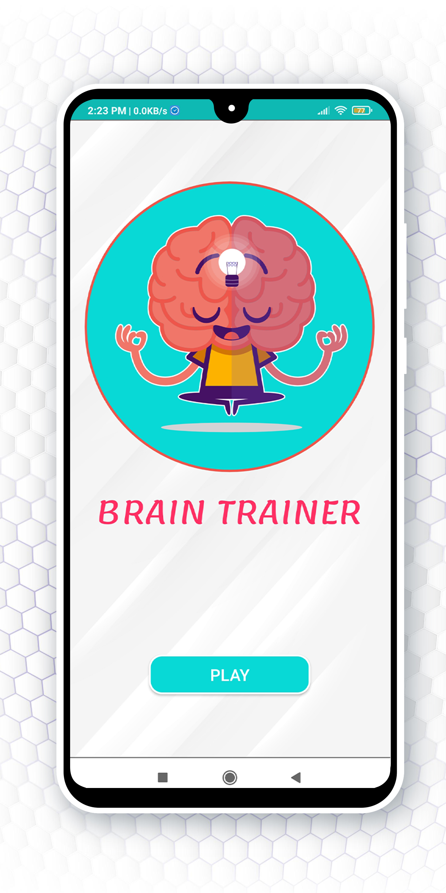

# Brain Training

## Brian Training  is a native android application for simple math problems with timer and some animations

 

<table style="width:100%" >
  
  <tr> 
   <th>   <h2>Home Screen</h2>   </th> 
  <tr/>
  <tr>
    <th></th>
  </tr>
  

  <tr>  
   <th>   <h2>PrePlay Screen</h2> </th>
  <tr/>
  <tr>
   <th></th>
  </tr>
  
  
  <tr>  
   <th>   <h2>Set Timer</h2> </th>
  <tr/>
  <tr>
   <th></th>
  </tr>
  
  
  <tr>  
   <th>   <h2>True Answer</h2> </th>
  <tr/>
  <tr>
   <th></th>
  </tr>
  
  
  <tr>  
   <th>   <h2>False Answer</h2> </th>
  <tr/>
  <tr>
   <th></th>
  </tr>
  
   
   
  <tr>  
   <th>   <h2>Score Screen</h2> </th>
  <tr/>
  <tr>
   <th></th>
  </tr>

  
</table>

# Brain Training video

 

# Follow Me 
<table>
  <tr>
  <th>
    
    </th>
   
   
   <th>
    
    </th>
    
   <th>
    
   </th>
  </tr>
</table>
